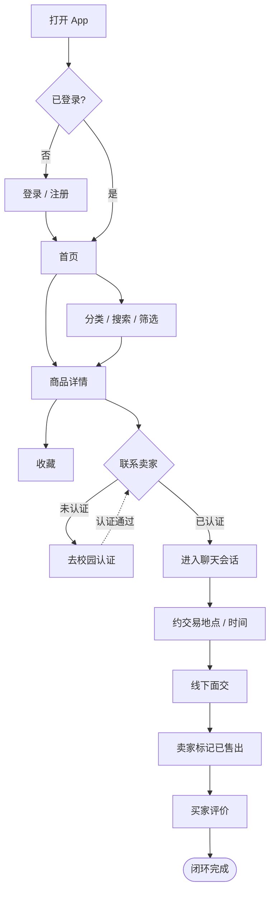
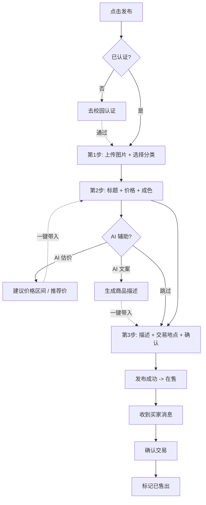
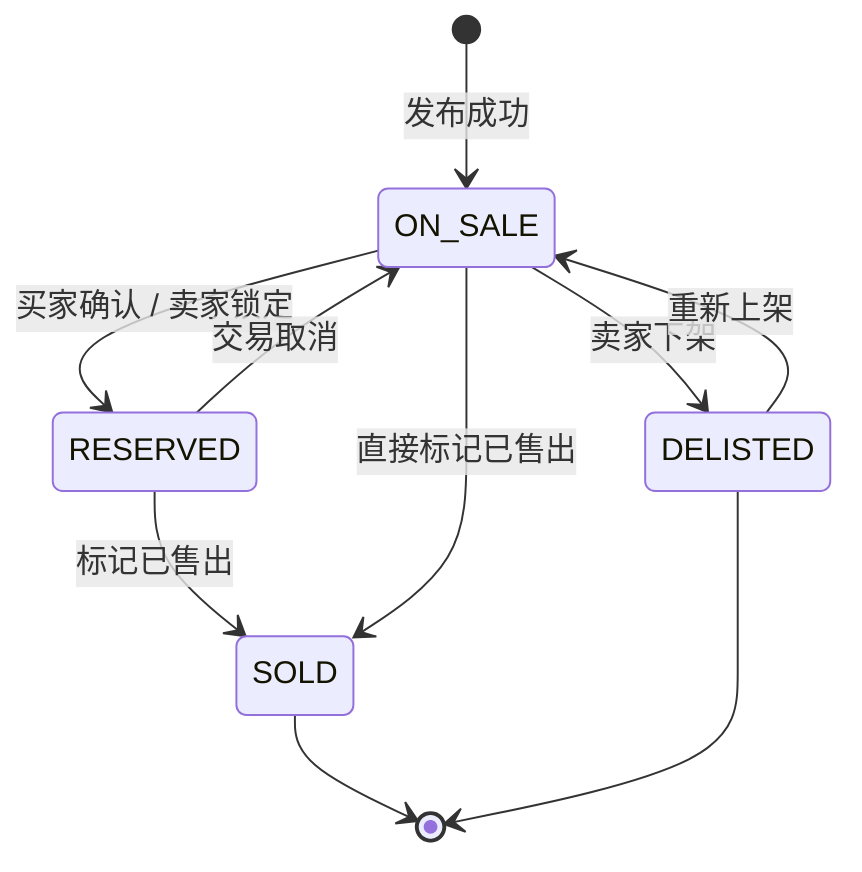
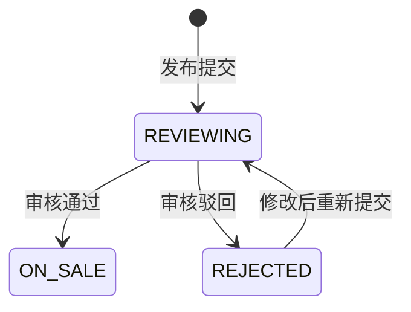

# 校园集市 · 前端 MVP 设计（逻辑优先）

> 本文档先于任何页面存在。页面是结果，不是起点。
> 先把三张图和状态机扎稳：**用户购买流程、用户发布流程、商品状态流转**。

## 0. 第一性原理

校园二手交易平台的核心不是"商品列表"，而是这条闭环链路：

```text
学生有闲置 → 快速发布 → 被附近学生看到 → 信任对方 → 沟通 → 约地点/交易 → 完成评价
```

MVP 只围绕这条链路做。直播、拍卖、社区、积分商城一律不做。

四个真正的特色（不是换皮咸鱼）：

1. **校园认证** —— 只有认证学生能发布、聊天、交易。
2. **校园距离** —— "南校区 · 0.3km · 图书馆附近" 比 "销量最高" 更重要。
3. **AI 估价 + AI 文案** —— 帮学生 30 秒发布。
4. **校园安全交易点** —— 图书馆门口 / 食堂大厅 / 宿舍楼下 / 教学楼大厅。

---

## 1. 用户购买流程图



要点：

- **未认证用户只能浏览**；收藏/聊天/发布/交易必须先认证（信任前置）。
- 平台**不做在线支付**，交易方式默认线下面交（与后端架构一致）。
- "联系卖家"是购买链路的关键转化点，它创建一个 `ChatSession`。

---

## 2. 用户发布流程图



要点：

- 发布拆成 **3 步**，不做长表单。
- AI 估价/文案是**可选增强**，不能挡住主流程（跳过也能发布）。
- 发布成功后商品进入 `ON_SALE`（若开启后台审核则先 `REVIEWING`）。

---

## 3. 商品状态流转图

MVP 基础版状态机（不开后台审核时）：



开启后台审核后，额外增加：



完整状态集合：`REVIEWING / ON_SALE / RESERVED / SOLD / DELISTED / REJECTED`。
MVP 第一版只用：`ON_SALE / RESERVED / SOLD / DELISTED`。

> 状态机是后端不乱的关键。前端 `domain/productStatus.ts` 是唯一的真相来源，
> 任何状态变更都必须经过 `canTransition()` / `transition()`，不允许页面直接赋值。

### 配套状态机

认证状态：`UNVERIFIED → PENDING → VERIFIED`，或 `PENDING → REJECTED → PENDING`。

会话状态：`ACTIVE → COMPLETED`（标记成交）/ `ACTIVE → CLOSED`（关闭）。

举报状态：`PENDING → RESOLVED` / `PENDING → DISMISSED`。

---

## 4. 数据模型

围绕闭环抽取的核心对象（字段与后端 `docs/architecture.md` 对齐，方便将来对接）：

| 实体 | 关键字段 | 作用 |
| --- | --- | --- |
| `User` | id, nickname, avatar, campus, verifyStatus, role, status | 角色与信任 |
| `Category` | id, name, icon, sortOrder | 分类入口 |
| `Product` | id, sellerId, title, price, originalPrice, conditionLevel, campus, locationDesc, status, viewCount, favoriteCount, images[] | 交易主体 |
| `Favorite` | id, userId, productId | 收藏 |
| `ChatSession` | id, productId, buyerId, sellerId, lastMessage, lastMessageTime, status | 沟通会话 |
| `Message` | id, sessionId, senderId, type(text/image/appointment), content, createdAt | 聊天消息 |
| `Appointment` | place, time, status(proposed/confirmed) | 约交易卡片（消息子类型） |
| `Verification` | id, userId, school, campus, studentNo, status, rejectReason | 校园认证 |
| `Report` | id, reporterId, targetType, targetId, reason, status | 举报 |
| `AIPriceRecord` | id, conditionLevel, originalPrice, suggestedMin/Max/Price, reason | AI 估价记录 |
| `Order` | id, productId, buyerId, sellerId, status, place, createdAt | 交易记录（线下面交） |

成色 `conditionLevel`：`NEW / ALMOST_NEW / GOOD / WORN`（全新 / 几乎全新 / 成色良好 / 有明显使用痕迹）。

---

## 5. AI 估价规则（第一版用规则模拟，不接真实模型）

```text
推荐价 = 原价 × 成色系数 × 热门系数
建议区间 = [推荐价 × 0.85, 推荐价 × 1.15]
```

成色系数：

| 成色 | 系数 |
| --- | --- |
| 全新 NEW | 0.80 |
| 几乎全新 ALMOST_NEW | 0.65 |
| 成色良好 GOOD | 0.50 |
| 明显使用 WORN | 0.30 |

热门系数：按分类是否处于需求旺季微调（如开学季教材 ×1.1，普通 ×1.0）。
输出附"理由"，例如：同类教材在本校区常见价格区间、当前成色、临近开学季需求上升。

AI 文案：把用户的"有机化学教材，八成新，有笔记"扩写为一段完整、可读、贴合校园交易场景的描述。

> AI 不需要多神。先用规则跑通闭环，保留 `campus-ai` 的 `/ai/*` 接口位，将来替换为真实大模型。

---

## 6. 前端代码分层（逻辑优先的落地方式）

```text
campus-web/src/
  domain/      纯 TS，无 UI 依赖：实体类型、状态机、AI 规则、交易地点
  data/        内存 Mock 仓库 + 种子数据（让闭环现在就能跑）
  api/         API 客户端抽象，对齐 gateway 路由 + ApiResponse 信封
  stores/      Pinia 状态（auth / product / favorite / chat / publish）
  router/      路由与登录/认证守卫
  pages/       学生端页面（结果层）
  pages/admin/ 后台页面（Phase 4）
  components/   复用 UI
```

### API 契约对齐后端

所有 mock 接口的返回都包成后端同款信封：

```ts
interface ApiResponse<T> { code: number; message: string; data: T }  // code===200 为成功
```

路由前缀与 `campus-gateway` 一致，将来把 mock client 换成 HTTP client 即可对接真实后端：

| 前缀 | 服务 | 端口 |
| --- | --- | --- |
| `/user/**` | campus-user | 8081 |
| `/product/**` | campus-product | — |
| `/order/**` | campus-order | — |
| `/ai/**` | campus-ai | — |
| `/message/**` | campus-message | — |
| 统一入口 | campus-gateway | 8080 |

---

## 7. MVP 分期（先活下来）

| 阶段 | 闭环 | 页面 |
| --- | --- | --- |
| **P1 浏览闭环** | 登录→首页→分类搜索→详情→收藏 | 登录/认证、首页、分类搜索、商品详情、收藏 |
| **P2 发布闭环** | 发布→AI 估价/文案→我的发布→状态管理 | 发布(3步)、AI 估价、我的发布 |
| **P3 沟通闭环** | 消息→聊天→约地点→标记已售出 | 消息列表、聊天详情、我的 |
| **P4 后台** | 用户/商品/认证/举报管理 | 后台登录、概览、用户、商品、认证、举报 |

底部导航 5 Tab：**首页 / 分类 / 发布 / 消息 / 我的**。

每完成一个阶段提交一次 git。先跑通逻辑，再让页面长出来。
