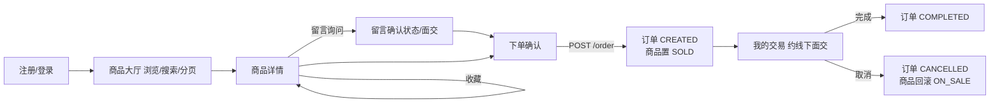
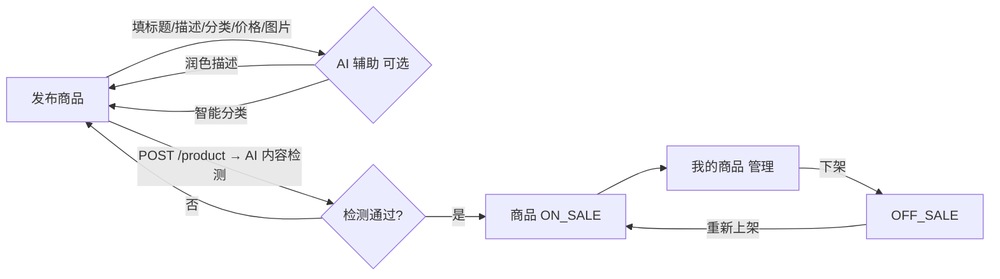

# CampusTrade AI 产品需求文档（PRD）v1

| 项 | 内容 |
| --- | --- |
| 版本 | v1（2026-06-23） |
| 状态 | 草案，作为"唯一规格来源"驱动原型与后端 |
| 范围 | MVP + 关键缺口（商品图片 / 收藏 / 个人主页 / 搜索分页） |
| 平台 | 桌面端先行，移动端后做 |
| 交易方式 | 仅线下面交，**不含在线支付/物流** |

> 配套物：可点击原型 [`campus-web-prototype/`](../../campus-web-prototype/index.html)、后端缺口路线图 [`docs/plans/2026-06-23-frontend-driven-backend-gaps.md`](../plans/2026-06-23-frontend-driven-backend-gaps.md)。本 PRD 的「页面字段表」「数据模型对照」是连接原型与后端的桥。

---

## 1. 背景与目标

### 1.1 背景
CampusTrade AI 是面向高校学生的校园二手交易平台。后端基于 Spring Cloud Alibaba，已分阶段实现 7 个微服务（user / product / order / message / ai / gateway / common），完成了全套 CRUD、JWT 鉴权与资源授权加固。但项目此前**缺少一个能跑、能点的产品规格**：只能从代码看出"每个接口能做什么"，却说不清整体产品"长什么样、流程怎么串"，导致难以判断后端还差什么。

本 PRD 的作用：把产品逻辑梳理清楚、钉成规格，反推后端缺口。

### 1.2 产品目标
- 让同校学生能**发布**闲置、**浏览/搜索**他人商品、**留言**沟通、**下单**约线下面交、并在**我的交易**里完成或取消订单。
- 用 AI 能力**辅助**（描述润色、智能分类、违规内容检测），AI 是发布辅助而非主流程。
- 架构清晰、功能可运行、文档可解释。

### 1.3 非目标（本产品明确不做）
- 在线支付、担保交易、物流配送 —— 校园交易默认**线下面交**。
- 跨校交易（默认同校/校区场景）。
- 本轮不做：评价评分、消息通知/IM 实时聊天、举报、管理员后台、移动端、真实大模型接入、图片上传到对象存储。

---

## 2. 目标用户与角色

| 角色 | 说明 | 本轮 |
| --- | --- | --- |
| 注册用户 | 高校学生，**同一账号既是买家也是卖家**：可发布也可购买 | ✅ |
| 游客 | 未登录，仅能浏览商品大厅与详情（不可下单/留言/收藏） | ✅（浏览只读） |
| 管理员 | 内容审核、违规处理 | 🔭 未来 |

**核心动机**：低价处理闲置 / 低价淘到同校好物；交易半径小、靠面交建立信任。

---

## 3. 功能范围

### 3.1 In-scope（本轮）
- 账号：注册、登录、登出、查看/编辑个人资料
- 商品：发布（含图片、AI 辅助）、浏览、**搜索 + 分页**、分类筛选、详情、上下架、按卖家筛选（"我的商品"）
- **收藏**：收藏/取消收藏、我的收藏列表
- 订单：下单、买家/卖家订单列表、取消、完成
- 留言：商品下留言、查看、隐藏/删除（仅发送者）
- **个人主页**：头像/昵称/校区 + 我的在售 / 我卖出的 / 我的收藏
- AI 辅助：描述润色、智能分类、发布时违规内容检测

### 3.2 Out-of-scope（后续里程碑）
评价评分、消息通知、实时聊天、举报、管理员后台、移动端适配、真实图片上传、真实大模型、在线支付。

---

## 4. 功能清单（按模块，标注实现状态）

> 状态：✅ 已实现 ｜ 🔧 需补（本轮缺口）｜ 🔭 未来

| 模块 | 功能 | 状态 | 对应接口 |
| --- | --- | --- | --- |
| 账号 | 注册 | ✅ | `POST /user/register` |
| 账号 | 登录（签发 JWT） | ✅ | `POST /user/login` |
| 账号 | 登出（Redis 黑名单） | ✅ | `POST /user/logout` |
| 账号 | 查看资料 | ✅（字段待扩展 🔧） | `GET /user/{id}` |
| 账号 | 密码哈希存储 | 🔧 | （注册/登录内部，BCrypt） |
| 账号 | 头像/校区资料 + 编辑 | 🔧 | `GET /user/{id}`（扩展）/ `PUT /user/profile` |
| 商品 | 发布（AI 内容检测） | ✅ | `POST /product` |
| 商品 | 商品图片 | 🔧 | `POST /product`（加 `imageUrl`） |
| 商品 | 浏览/搜索/分类筛选 | ✅ | `GET /product?keyword&category&status` |
| 商品 | 按卖家筛选（我的商品） | 🔧 | `GET /product?sellerId=` |
| 商品 | 分页 | 🔧 | `GET /product?page&size` |
| 商品 | 详情 | ✅ | `GET /product/{id}` |
| 商品 | 上下架（仅卖家） | ✅ | `PUT /product/{id}/status` |
| 商品 | 列表/详情带卖家昵称、校区 | 🔧 | 上述接口响应扩展（Feign 取昵称） |
| 收藏 | 收藏 / 取消收藏 | 🔧 | `POST` / `DELETE /product/{id}/favorite` |
| 收藏 | 我的收藏列表 | 🔧 | `GET /product/favorites` |
| 订单 | 下单（校验买家/卖家/商品，置 SOLD） | ✅ | `POST /order` |
| 订单 | 详情（仅买卖双方） | ✅ | `GET /order/{id}` |
| 订单 | 买家/卖家订单列表 | ✅ | `GET /order/buyer/{id}`、`GET /order/seller/{id}` |
| 订单 | 取消（回滚 ON_SALE）/ 完成 | ✅ | `PUT /order/{id}/cancel`、`/complete` |
| 留言 | 商品下留言 | ✅ | `POST /message` |
| 留言 | 按商品查看 | ✅ | `GET /message/product/{productId}` |
| 留言 | 隐藏 / 删除（仅发送者） | ✅ | `PUT /message/{id}/hide`、`DELETE /message/{id}` |
| 留言 | 留言带发送者昵称 | 🔧 | 上述响应扩展（Feign 取昵称） |
| AI | 描述润色 / 智能分类 / 内容检测 | ✅ | `POST /ai/description/optimize`、`/category/predict`、`/content/check` |

---

## 5. 用户故事

**买家**
- 作为买家，我想按关键词/分类搜索商品并翻页，以便快速找到想要的东西。
- 作为买家，我想先在商品下留言确认状态和面交地点，再决定是否下单。
- 作为买家，我想下单后商品自动标记为已售，避免别人重复购买。
- 作为买家，我想把心仪商品收藏起来，稍后在"我的收藏"里再看。

**卖家**
- 作为卖家，我想发布商品时上传图片、用 AI 润色描述和推荐分类，让商品更好卖。
- 作为卖家，我想在"我的商品"里管理上下架。
- 作为卖家，我想看到买家留言并回复，约定面交。

**通用**
- 作为用户，我想注册时填昵称和校区，登录后在个人主页看到我的在售/卖出/收藏。
- 作为用户，我希望只有我自己能改我的商品、我的订单、我的留言（已通过 JWT 身份授权保证）。

---

## 6. 核心流程

### 6.1 交易闭环（买家视角）



### 6.2 发布与管理（卖家视角）



---

## 7. 信息架构 / 页面地图

```
登录 / 注册
└─ 主应用（登录后）
   ├─ 商品大厅（默认）：搜索 + 分类 + 分页 + 收藏入口
   │   └─ 商品详情：图片 / 卖家卡 / 收藏 / 留言 / 下单
   │       └─ 订单确认 → 我的交易
   ├─ 我的交易：我买到的 / 我卖出的（取消·完成）
   ├─ 发布 / 管理商品：发布表单(AI辅助) + 我的商品(上下架)
   └─ 我的主页：资料(头像/昵称/校区) + 我的在售 / 我卖出的 / 我的收藏
```

---

## 8. 页面清单与字段表

> 「调用接口」列即原型 `API_MAP` 的依据；🔧 标注的字段/接口为本轮需补。

### 8.1 登录 / 注册
- **用途**：进入应用。登录 / 注册双态切换。
- **输入**：登录=用户名、密码；注册=用户名、昵称、密码、校区🔧。
- **调用**：`POST /user/login` → 返回 `{token, profile}`；`POST /user/register`。

### 8.2 商品大厅（市场）
- **展示**：商品卡片（图片🔧、标题、价格、分类、卖家昵称🔧、校区🔧、状态徽标、收藏心形🔧）；分页控件🔧；空态/加载态。
- **操作**：搜索、切分类、翻页、点收藏、进详情、去发布。
- **调用**：`GET /product?keyword=&category=&status=ON_SALE&page=&size=`🔧；`POST/DELETE /product/{id}/favorite`🔧。

### 8.3 商品详情
- **展示**：图片🔧、标题、价格、状态、描述、卖家卡（昵称/校区🔧）、面交流程条、留言列表（含发送者昵称🔧）。
- **操作**：收藏🔧、留言发送、下单（仅 `ON_SALE` 可点）。
- **调用**：`GET /product/{id}`；`GET /message/product/{productId}`；`POST /message`；进入下单走 `POST /order`。

### 8.4 订单确认
- **展示**：商品摘要、卖家、建议面交、规则说明（下单后 CREATED + 商品 SOLD、无在线支付）。
- **操作**：确认下单 / 返回详情。
- **调用**：`POST /order`（请求体仅 `productId`，买家身份取自 JWT）。

### 8.5 我的交易
- **展示**：分「我买到的 / 我卖出的」两个 tab；订单行（商品缩略图、状态徽标、对方昵称、面交备注）。
- **操作**：完成交易、取消（CREATED 态可操作）、查看商品。
- **调用**：`GET /order/buyer/{buyerId}`、`GET /order/seller/{sellerId}`；`PUT /order/{id}/complete`、`/cancel`。

### 8.6 发布 / 管理商品
- **输入**：标题、描述、分类、价格、图片 URL🔧。
- **操作**：AI 润色描述、AI 智能分类、发布；我的商品列表上下架。
- **调用**：`POST /ai/description/optimize`、`POST /ai/category/predict`；`POST /product`；`GET /product?sellerId={me}`🔧；`PUT /product/{id}/status`。

### 8.7 我的主页🔧
- **展示**：头像🔧、昵称、校区🔧；tab：我的在售 / 我卖出的 / 我的收藏。
- **操作**：编辑资料🔧、进入对应商品/订单。
- **调用**：`GET /user/{id}`（扩展字段）🔧、`PUT /user/profile`🔧；`GET /product?sellerId={me}`🔧、`GET /order/seller/{me}`、`GET /product/favorites`🔧。

---

## 9. 状态机

### 9.1 商品状态
```
ON_SALE ──下架──▶ OFF_SALE ──重新上架──▶ ON_SALE
ON_SALE ──被下单──▶ SOLD ──订单取消──▶ ON_SALE
```
- 触发：卖家上下架（`PUT /product/{id}/status`，仅卖家）；下单置 `SOLD`、取消回滚 `ON_SALE`（由订单服务联动）。

### 9.2 订单状态
```
（下单）──▶ CREATED ──完成──▶ COMPLETED
                  └──取消──▶ CANCELLED（商品回滚 ON_SALE）
```
- 触发：买卖任一方可取消/完成（`isParticipant` 授权）。

### 9.3 留言状态
```
VISIBLE ──隐藏──▶ HIDDEN ；DELETE 物理删除（均仅发送者）
```

---

## 10. 非功能需求

- **交易方式**：仅线下面交，面交时间/地点通过留言协商，订单不含支付字段。
- **安全**：
  - 网关统一 JWT 鉴权；登录/注册精确放行；网关覆盖客户端伪造的 `X-User-Id`，下游以 JWT 透传身份做资源授权。
  - 密码必须哈希存储（BCrypt）🔧——当前为明文，本轮第一阶段修复。
- **性能/稳定**：`GET /product` 已接入 Sentinel QPS 限流；列表需分页避免全量返回🔧。
- **可观测/文档**：5 个 servlet 服务接入 Knife4j（`/doc.html`）。
- **可解释**：每个功能阶段同步代码 + 测试 + 文档（项目既有习惯）。

---

## 11. 数据模型对照（现有 + 需新增）

| 实体 | 现有字段 | 需新增🔧 |
| --- | --- | --- |
| `user` | id, username, password(明文), nickname | password 改哈希；`avatar_url`、`campus` |
| `product` | id, seller_id, title, description, category, price, status | `image_url`、`campus`（可选） |
| `favorite`（新表） | — | id, user_id, product_id, created_at（唯一键 user_id+product_id） |
| `orders` | id, buyer_id, seller_id, product_id, product_title, price, status | （可选 `remark` 面交备注，本轮不加） |
| `message` | id, product_id, sender_id, content, status | （响应带昵称，表不变） |

> 响应层：`ProductResponse` / `MessageResponse` 需补 `sellerNickname` / `senderNickname`（经 OpenFeign 调 campus-user 取，沿用 order/message 既有 Feign 模式）。

---

## 12. 迭代里程碑

| 里程碑 | 内容 | 状态 |
| --- | --- | --- |
| **M1** | 本 PRD + 可点击桌面原型 + 后端缺口路线图 | 🚧 本轮 |
| **M2** | 按路线图逐阶段补齐后端缺口（密码哈希 → 商品字段 → 昵称透出 → 收藏 → 个人资料），每阶段含测试与文档 | ⏭️ 下一步 |
| **M3** | 上真实前端框架（Vue 3 / Element Plus）联调网关接口 | 🔭 |
| **M4** | 移动端适配 | 🔭 |
| **M5** | 真实大模型接入、评价/通知/管理员后台等 | 🔭 |
